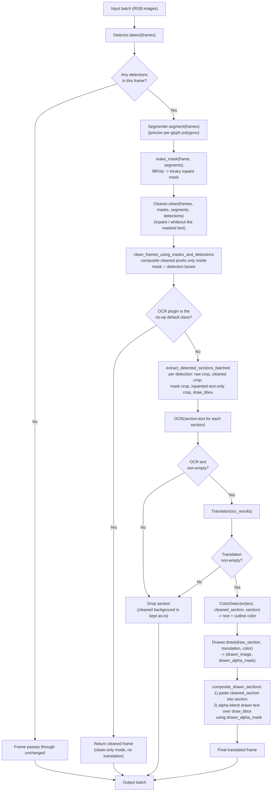

# Translator Architecture

This document describes the architecture of `localizer/src/comic_localizer`: a
plugin-based, config-driven pipeline for detecting, cleaning, translating, and
redrawing text in manga/comic images.

## High-level design

The package is built around a small set of **plugin base classes** (one per
pipeline stage). Every concrete implementation (a YOLO detector, a DeepL
translator, an OpenCV inpainting cleaner, ...) subclasses one of these bases
and can be swapped in independently. Two top-level **pipelines** wire plugin
instances together:

- `ImageToImagePipeline` — takes a batch of images, returns the same images
  with text detected, cleaned, translated, and redrawn.
- `CbzPipeline` — reads pages out of a `.cbz` (zip) archive, runs them through
  an `ImageToImagePipeline` in batches, and writes a translated `.cbz` back out.

Pipelines are assembled either directly in code (see `src/main.py`) or from a
YAML config file via `construct_image_to_image_pipeline_from_config` in
`get.py`.

## Package layout

```
src/comic_localizer/
├── core/            # Plugin base classes, argument/config system, shared types
├── detection/        # Detector plugins (find text bubble/free-text boxes)
├── segmentation/      # Segmenter plugins (precise per-glyph polygons)
├── cleaning/         # Cleaner plugins (remove/inpaint original text)
├── color_detection/    # ColorDetector plugins (pick text/outline color)
├── ocr/             # OCR plugins (extract text from a cropped section)
├── translation/       # Translator plugins (translate OCR text)
├── drawing/          # Drawer plugins (render translated text back into the image)
├── pipelines/        # ImageToImagePipeline and CbzPipeline (orchestration)
├── utils.py          # Shared helpers (color conversion, text layout, language codes, ...)
└── get.py            # Plugin registry + YAML config loader
```

Each of the eight plugin-category folders (`detection`, `segmentation`,
`cleaning`, `color_detection`, `ocr`, `translation`, `drawing`) follows the same
pattern: a `get.py` that lists its concrete, `is_valid()`-passing
implementations, plus one file per implementation.

## Core abstractions (`core/plugin.py`)

Every plugin subclasses `BasePlugin`, which defines three static methods every
implementation should override:

- `get_name() -> str` — display name (used by UIs/config).
- `get_arguments() -> list[PluginArgument]` — declares the constructor
  parameters (as `StringPluginArgument`, `IntPluginArgument`,
  `BooleanPluginArgument`, `SelectPluginArgument`, `LanguageStringArgument`,
  `PytorchDevicePluginArgument`, ...) so a config file or UI can construct the
  plugin without knowing its Python signature ahead of time.
- `is_valid() -> bool` — lets an implementation opt out of the registry (e.g.
  if an optional dependency isn't installed).

The seven pipeline-stage base classes, each with a default no-op
implementation and an async `__call__` entry point:

| Base class     | `__call__` signature                                                          | Produces |
|-----------------|--------------------------------------------------------------------------------|----------|
| `Detector`      | `(frames) -> list[list[DetectionResult]]`                                       | Bounding boxes for text-bearing regions (`DetectionType.TextInBubble` / `TextOnPage`) |
| `Segmenter`     | `(frames) -> list[list[SegmentationResult]]`                                     | Per-glyph/word polygons (`points`) used to build a precise inpainting mask |
| `Cleaner`       | `(frames, masks, segments, detections) -> list[np.ndarray]`                       | Frames with the original text removed/inpainted |
| `ColorDetector` | `(text, cleaned, original) -> list[ColorDetectionResult]`                        | Text + outline RGB color to draw with |
| `OCR`           | `(batch of cropped sections) -> list[OcrResult]`                                 | Extracted text + detected language per section |
| `Translator`    | `(batch of OcrResult) -> list[TranslatorResult]`                                 | Translated text + target language per section |
| `Drawer`        | `(frames, translations, colors) -> list[(drawn_image, drawn_mask)]`               | Rendered translated text plus an alpha mask for compositing |

`construct_plugin(cls, arguments)` (also in `core/plugin.py`) takes a plugin
class and a `dict` of raw argument values, matches them against
`cls.get_arguments()`, applies each argument's `convert_fn` (e.g.
`LanguageStringArgument` standardizes a language string via `langcodes`,
`PytorchDevicePluginArgument` resolves a device string to a `torch.device`),
and instantiates the class.

## Plugin registry & config loading (`get.py`)

`get.py` aggregates every implementation from every category's `get.py` into
one name → class registry (`get_all()`), and exposes:

- `construct_plugin_by_name(class_name, arguments)` — look up a class by name
  and build it via `construct_plugin`.
- `construct_image_to_image_pipeline_from_config(config_path)` — reads a YAML
  file shaped like:
  ```yaml
  pipeline:
    detector: {class: YoloDetector, args: {model_path: "..."}}
    segmenter: {class: YoloSegmenter, args: {model_path: "..."}}
    cleaner:   {class: OpenCvCleaner, args: {}}
    translator: {class: DeepLTranslator, args: {auth_key: "...", language: "en"}}
    ocr:       {class: MangaOCR, args: {}}
    drawer:    {class: HorizontalDrawer, args: {}}
    color_detector: {class: Default}
  ```
  and constructs each named stage (`class: Default` skips the stage, leaving
  the pipeline's built-in no-op base class in place), then builds an
  `ImageToImagePipeline` from the results.

## Available plugin implementations

| Category | Implementations |
|---|---|
| Detector | `YoloDetector` (Ultralytics YOLO) |
| Segmenter | `YoloSegmenter` (Ultralytics YOLO, instance segmentation) |
| Cleaner | `AllWhiteCleaner`, `OpenCvCleaner` (`cv2.inpaint`), `LamaCleaner`, `DeepFillV2Cleaner` (both share `PatchedAiCleaner`: torch-scripted inpainting models, optionally run per-patch instead of on the whole frame) |
| ColorDetector | `BasicColorDetector` (black-on-white heuristic), `OpenAiColorDetector` |
| OCR | `DebugOCR`, `MangaOCR`, `HuggingFaceOCR`, `OpenAiOCR`, `MinstralOCR`, `GoogleCloudOCR` |
| Translator | `DebugTranslator`, `PipeTranslator` (passthrough), `DeepLTranslator`, `HuggingFaceTranslator`, `OpenAiTranslator` |
| Drawer | `HorizontalDrawer` (font-fit + wrap text renderer) |

## Color-space convention

Arrays flowing through the pipeline are **RGB**, end to end (confirmed by
`CbzPipeline.read_image`, which decodes with `cv2.IMREAD_COLOR_RGB`, and
`CbzPipeline.write_image_sync`, which converts RGB→BGR immediately before
`cv2.imwrite`). Any code that hands an image to a BGR-only API (`cv2.imencode`,
`cv2.imwrite`, Ultralytics YOLO's `predict`, which expects BGR — hence the
`x[..., ::-1]` flips in `detection/yolo.py` and `segmentation/yolo.py`) must
convert at that boundary, not before. PIL-facing helpers (`cv2_to_pil`,
`pil_to_cv2`, `ensure_gray` in `utils.py`) assume RGB throughout, since PIL's
own array convention is RGB.

## The two pipelines

### `ImageToImagePipeline` (`pipelines/image_to_image.py`)

Constructed from one instance of each plugin base class (defaults to the
no-op base classes if not supplied). Its `__call__(batch: list[np.ndarray])`
is the entire per-image translation flow — see the flowchart below. Two
internal dataclasses carry state through the pipeline:

- `TranslatableFrame` — a frame that had at least one detection, plus its
  detections and (once computed) segments.
- `FrameSection` — one detected region within a frame: the raw crop, the
  cleaned crop, the inpainted-mask-only crop fed to OCR (`text`), the mask
  crop, and a separately-computed tighter `draw_bbox`/`draw_section` used for
  laying out the translated text (via `compute_draw_bbox`, which shrinks the
  drawing area to the actual bright content inside the detection box).

### `CbzPipeline` (`pipelines/cbz.py`)

Extracts a `.cbz` archive to a temp directory (validating member paths against
zip-slip and naturally sorting page filenames), reads pages in batches of
`batch_size`, runs each batch through an `ImageToImagePipeline`, and writes the
results back out to `output_path`, preserving the archive's folder structure.

## Image processing flow

For a single image with at least one detection, `ImageToImagePipeline.__call__`
does the following (frames with zero detections skip straight through
unchanged):



Notes on the diagram:

- The **mask** built in `make_mask` comes from segmentation polygons (tight,
  per-glyph), while the **detection boxes** from the detector are coarser
  (whole speech bubble / text block). Cleaning is deliberately restricted to
  `mask ∩ detection box` (`clean_frame_using_masks_and_detections`) so that
  cleaning never bleeds outside a detected region even if a segment polygon
  extends past it.
- Sections whose OCR result or translation is empty are filtered out before
  color detection/drawing (`valid_ocr_indices` / `valid_translation_indices`)
  — the corresponding image region keeps its cleaned (but undrawn) content.
- The final composite in `composite_drawn_sections` is two steps: first the
  cleaned crop overwrites the original text in-place, then the drawn text is
  alpha-blended on top using the drawer's own mask, so anti-aliased text edges
  blend into the cleaned background instead of leaving hard edges.

## Testing

Unit/integration tests live in `localizer/tests/src/`, one file roughly per
module (e.g. `test_cbz_pipeline.py`, `test_patched_ai_cleaner.py`,
`test_components.py` for OCR/translation/cleaning/drawing plugin behavior).
Run them with `pytest` from `localizer/tests/` (a separate `uv`-managed venv
from the main `localizer/` package).
